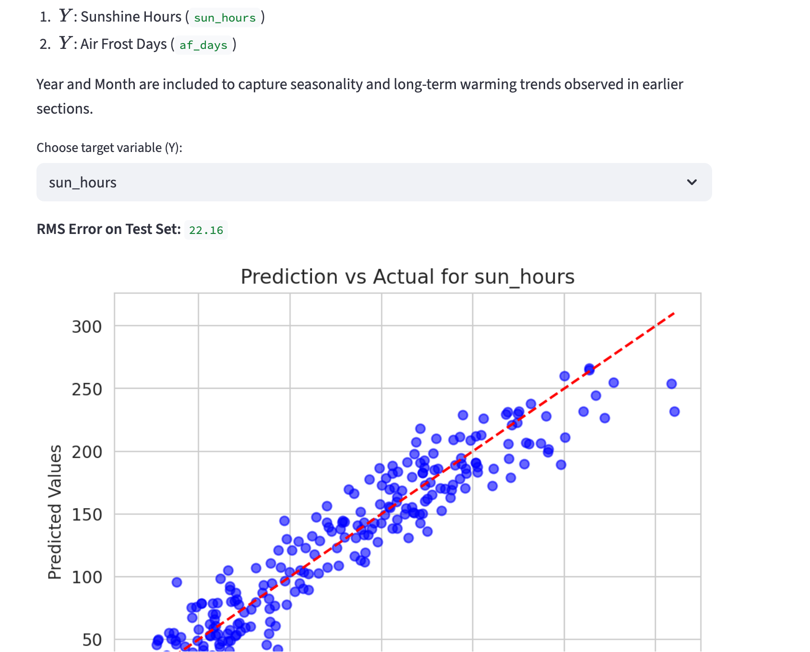
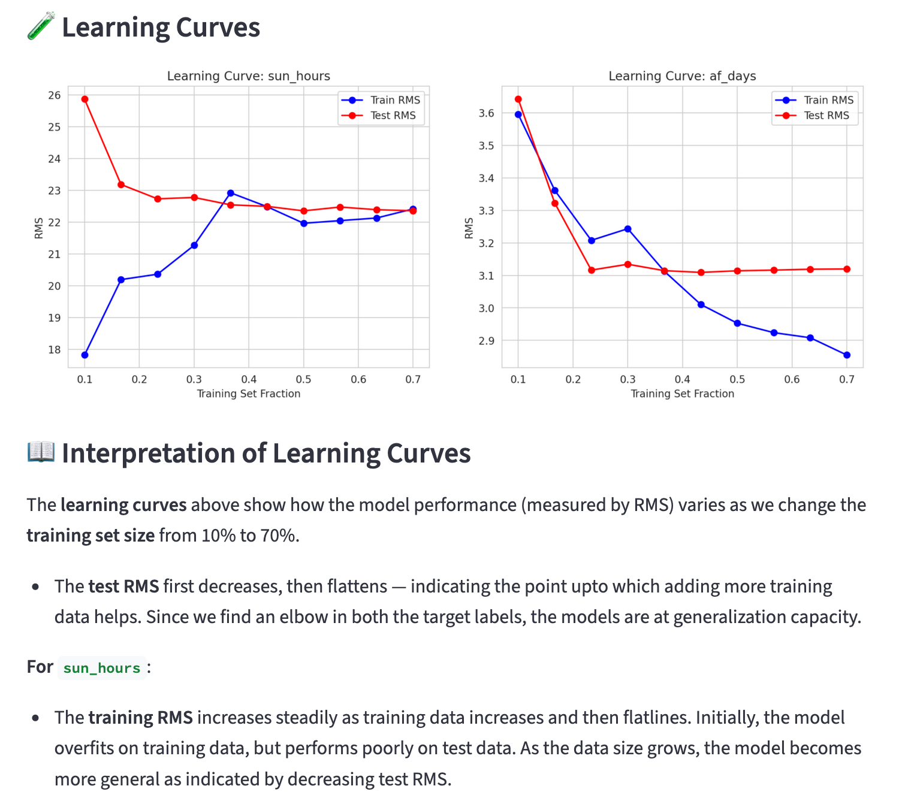
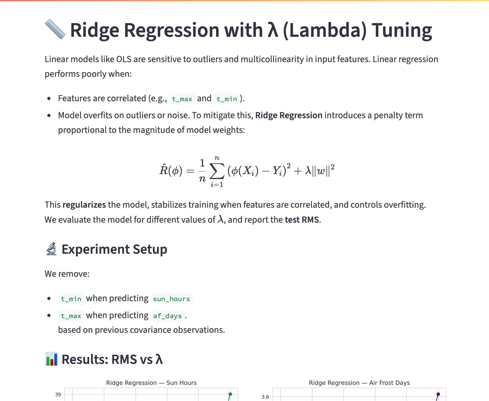
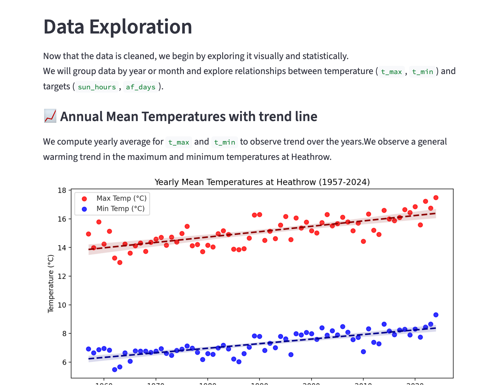

----

# 🌤️ Climate Regression at Heathrow (1957–2024)

This project explores weather data from the **Met Office station at Heathrow** to model and predict two key climate indicators:

- ☀️ **Monthly Sunshine Hours**
- ❄️ **Monthly Air Frost Days**

We use **Linear Regression** and **Ridge Regression** to understand climate trends and build interpretable predictive models.

The aim is **not** to show advance ML techniques but to take a deep dive into model tuning, evaluation and validation. 

---

## Data Source

Data Source:

Met Office, Govt. of UK
Historic Station Data

<https://www.metoffice.gov.uk/pub/data/weather/uk/climate/stationdata/heathrowdata.txt>

Data used under "Open Government Licence" as published on Met Office website.

<https://www.metoffice.gov.uk/policies/legal>

---

## 📊 App Demo

👉 [Try the interactive Streamlit app here](https://climate-regression-app.streamlit.app/)

<div style="border: 2px solid black;"></div>
<div style="border: 2px solid black;"></div>
<div style="border: 2px solid black;"></div>
<div style="border: 2px solid black;"></div>


---

## 🧠 What This Project Covers

### 🔍 Data

- Source: Heathrow weather station data (Met Office)
- Range: 1957–2024
- Cleaned, parsed, and transformed into a tidy dataframe
- Features:
  - `t_max`, `t_min`: mean monthly max/min temperature
  - `sun_hours`: total sunshine hours in the month
  - `af_days`: number of air frost days in the month
  - `yyyy`, `mm`: year and month

### 📈 Modeling

- Linear Regression
- Ridge Regression with hyperparameter tuning
- K-Fold Cross-Validation

### 🧪 Evaluation

- Root Mean Squared Error (RMS)
- Learning Curves across training sizes
- Feature correlation and multicollinearity analysis
- Error trends across regularization parameters (\( \lambda \))

---

## 📘 Learning Outcomes

- Interpreting simple linear models in climate data
- Diagnosing model behavior using training/test splits
- Using Ridge Regression to manage correlated features
- Performing and visualizing K-fold cross-validation
- Communicating model choices with clarity

---

## 💻 Running the App Locally

```bash
git clone https://github.com/your-username/climate-regression-heathrow.git
cd climate-regression-heathrow
pip install -r requirements.txt
streamlit run app.py

